# Дипломный практикум в Yandex.Cloud
  * [Цели:](#цели)
  * [Этапы выполнения:](#этапы-выполнения)
     * [Создание облачной инфраструктуры](#создание-облачной-инфраструктуры)
     * [Создание Kubernetes кластера](#создание-kubernetes-кластера)
     * [Создание тестового приложения](#создание-тестового-приложения)
     * [Подготовка cистемы мониторинга и деплой приложения](#подготовка-cистемы-мониторинга-и-деплой-приложения)
     * [Установка и настройка CI/CD](#установка-и-настройка-cicd)
  * [Что необходимо для сдачи задания?](#что-необходимо-для-сдачи-задания)
  * [Как правильно задавать вопросы дипломному руководителю?](#как-правильно-задавать-вопросы-дипломному-руководителю)

**Перед началом работы над дипломным заданием изучите [Инструкция по экономии облачных ресурсов](https://github.com/netology-code/devops-materials/blob/master/cloudwork.MD).**

---
## Цели:

1. Подготовить облачную инфраструктуру на базе облачного провайдера Яндекс.Облако.
2. Запустить и сконфигурировать Kubernetes кластер.
3. Установить и настроить систему мониторинга.
4. Настроить и автоматизировать сборку тестового приложения с использованием Docker-контейнеров.
5. Настроить CI для автоматической сборки и тестирования.
6. Настроить CD для автоматического развёртывания приложения.

---
## Этапы выполнения:


### Создание облачной инфраструктуры

   Создание облачной инфраструктуры происходит в несколько этапов. Первым этапом создаются все необходимые сущности для хранения  backend в бакете S3 от ЯО. Описание манифестов ```terraform``` для S3 расположены тут - [S3](./terraform/S3/). Следующим этапом идет подготовка непосредственно инфраструктуры для кластера k8s (СА, сети, диски, тип ВМ и пр.). Описание всех  манифестов для создания инфрастурктуры  тут - [infra](./terraform/infra/)
    
---
### Создание Kubernetes кластера

   Кластер k8s будет развернут на 3-х нодах - 1 мастер и 2 воркера. Для установки выбрал вариант развертывания кластера через  kubeadm. Подготовил playbooks
для установки необходимых  компонентов на узлы кластера. На этапе установки  с помощью  ansible происходит следующее:
   
   1. Предварительная подготовка  системы (проверка/установка  необходимых модулей). Установка необходимых пакетов,  в том числе kubeadm, kubelet и kubectl
   2. Инициализация кластера  на мастер ноде, установка CNI Calico и получение ссылки для присоединения воркер нод
   3. Присоединение воркер нод  к кластеру  с помощью  полученной ранее команды
   4. Проверка статуса кластера

  
Ожидаемый результат:

1. Работоспособный Kubernetes кластер.
2. В файле `~/.kube/config` находятся данные для доступа к кластеру.
3. Команда `kubectl get pods --all-namespaces` отрабатывает без ошибок.

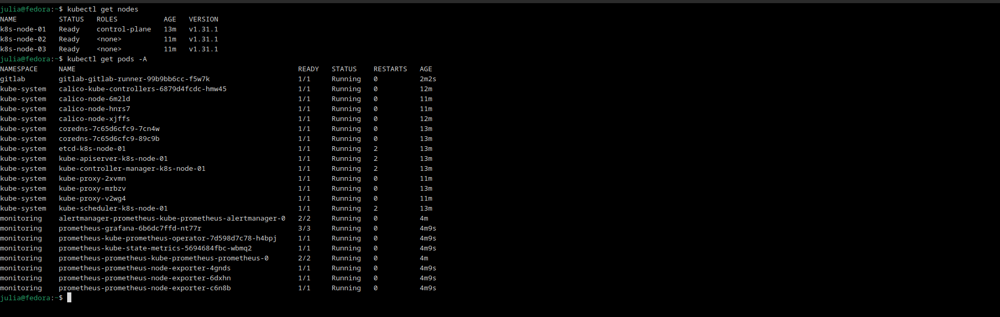

---
### Создание тестового приложения

Для хранения образа  контейнера  приложения сначала создал Registry в ЯО c помощью ```terraform```. Все манифесты находятся в директории [registry](./terraform/registry/). Еще на этапе подготовки инфраструктуры для кластера k8s была добавлена  машина для установки Gitlab из  приватных  образов ЯО. На этом инстансе GitLab
и был создан  репорзиторий для хранения файлов приложения и Dockerfile.

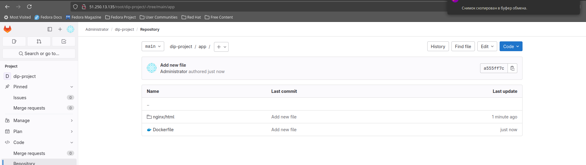

контейнер  приложения успешно собирается  и загружается в  Registry ЯО

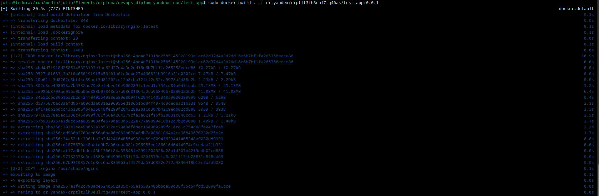

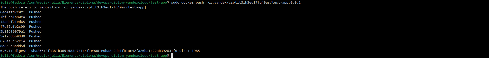

После выполнения команд  проверяем наличие образа  в Registry

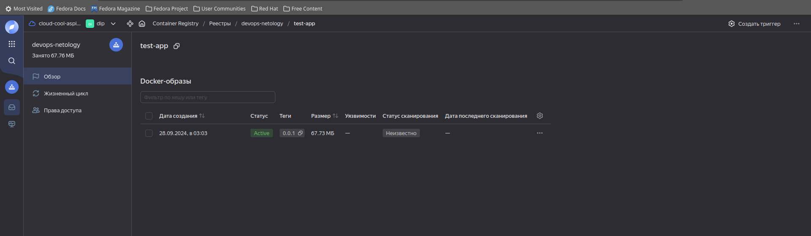

---
### Подготовка cистемы мониторинга и деплой приложения

Для мониторинга состояния кластера буду использовать helm-chart kube-prometheus-stack. Заранее подготовил файл values.yaml для установки.
Сама установка helm и  chart prometheus стека. Происходит еще на этапе установки и инициализации кластера k8s. После успешной настройки кластера происходит
установка helm  на мастер-ноду и установка стека для мониторинга. ([helm](./ansible-playbook/helm_install.yaml),[moniroting](./ansible-playbook/monitoring/))

После успешного выполнения playbook можно проверить работу  Grafana  и сбор метрик временно выставив ее наружу. Для этого  необходимо выполнить команду:

```bash

kubectl port-forward svc/prometheus-grafana -n monitoring --address 0.0.0.0 8080:80
```

И перейти по адресу http://<external_master_ip>:8080. Зайти паролем по умолчанию  и проверить поступление метрик кластера
Как видно из скриншота метрики кластера успешно собираются

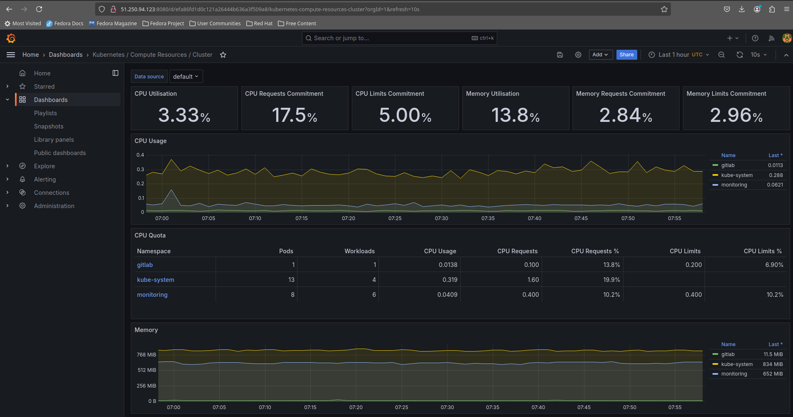

Далее приступим к деплою нашего приложения в кластер k8s. Подготовил базовый deployment для приложения - [deployment](./k8s/deployment.yaml). 
Для развертывания приложения в кластер запускаем команду из директории c файлом ```deployment.yaml```

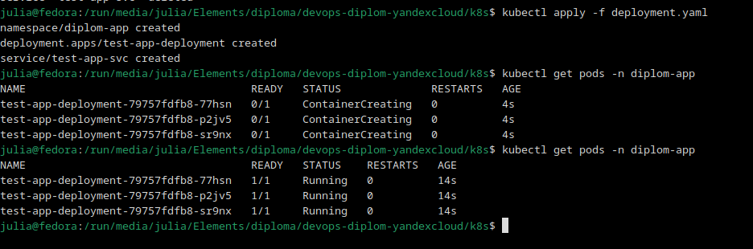

Как мы видим все сущности создались и приложение развернулось в кластере. Теперь проверим доступ к нашему приложению  по http, 
перейдя по адресу ```http://<external_master_ip>:30080``` 

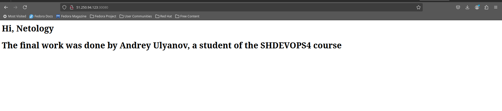

Доступ к приложению  извне есть


---
### Установка и настройка CI/CD

Для CI/CD буду использовать Gitlab. Для этого была равернута ВМ  Gitlab  из  публичного образа ЯО. Она  с помощью ```terraform``` создается еще на первом этапе при  создании ВМ для кластера k8s. Установка и настройка основных  компонентов Gitlab осуществлянтся автоматически  при развертывании.  Для настройки компонентов Girtlab требуется время, поэтому сразу после деплоя ВМ  Gitlab будет недоступен,  нужно подождать  около 10 мин. Дожидаемся работы веб-интерфейса, заходим. Создаем проект и наполняем его  необходимыми файлами

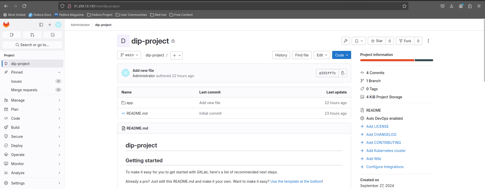

Для автоматической сборки необходим  раннер,  который собственно  и  будет собирать образ  нашего  приложения и отправлять в Yandex Registry
Установка и настройка также происходит на первом этапе установки после успешной инициализации кластера k8s - сам раннер  устанавливается внутри  кластрера k8s по аналогии со стеком миониторинга. Подробнее тут - [install runner](./ansible-playbook/gitlab/). Проверяем состояние раннера  в Gitlab

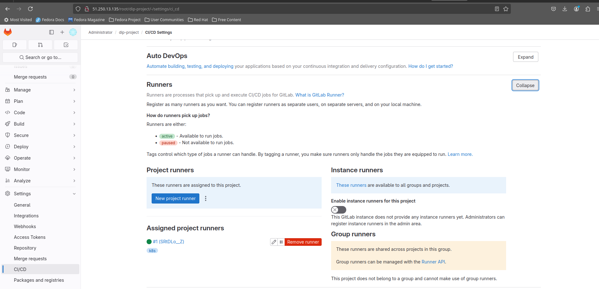


Далее для корректной работы раннера  необходимо создать сервисный аккаунт в кластере k8s, с помощью которого gitlab  будет работать с кластером.

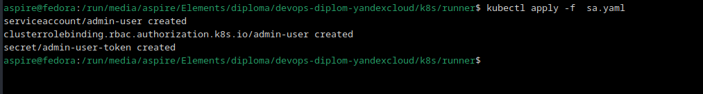

Далее  по инструкции  от ЯО  получаем токен  созданного  СА  и вносим его  в переменные  проекта  в Gitlab. Также добавдяем  и другие переменные
для корректной работы pipeline.

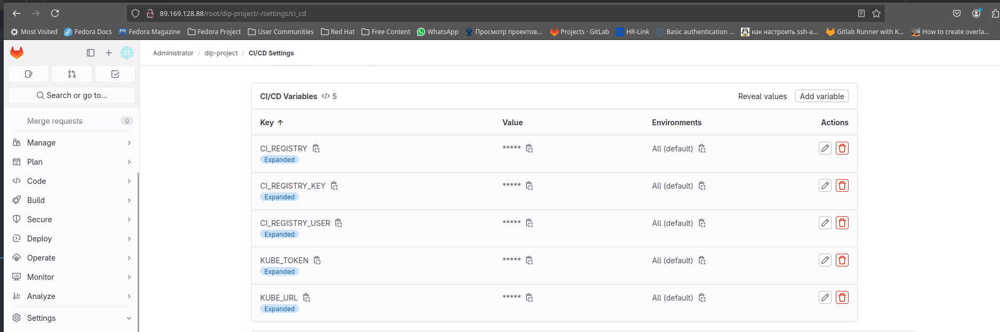


Создадим файл .gitlab-ci.yml 

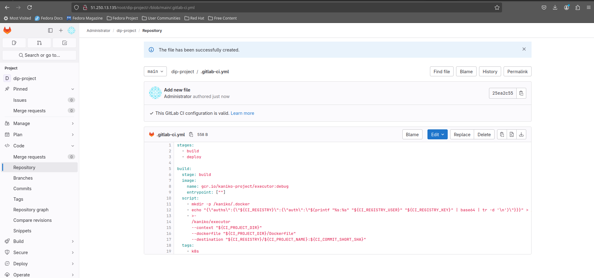

после сохранения  идем в Build -> Pipelines и наблюдаем  выполнение build

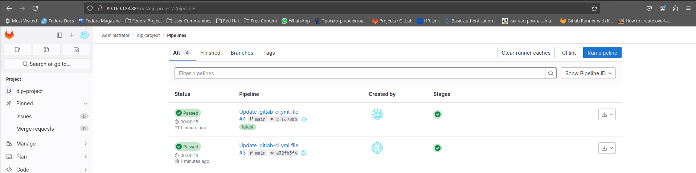


Как видим образ runner собирает образ и пушит его  в репозиторий ЯО

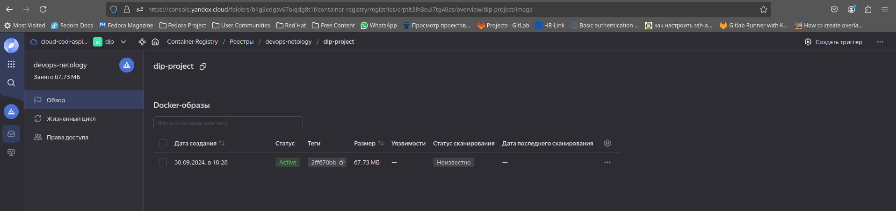


Осталось настроить ci/cd систему для автоматической сборки docker image и деплоя приложения при изменении кода.

Цель:

1. Автоматическая сборка docker образа при коммите в репозиторий с тестовым приложением.
2. Автоматический деплой нового docker образа.

Можно использовать [teamcity](https://www.jetbrains.com/ru-ru/teamcity/), [jenkins](https://www.jenkins.io/), [GitLab CI](https://about.gitlab.com/stages-devops-lifecycle/continuous-integration/) или GitHub Actions.

Ожидаемый результат:

1. Интерфейс ci/cd сервиса доступен по http.
2. При любом коммите в репозиторие с тестовым приложением происходит сборка и отправка в регистр Docker образа.
3. При создании тега (например, v1.0.0) происходит сборка и отправка с соответствующим label в регистри, а также деплой соответствующего Docker образа в кластер Kubernetes.

---
## Что необходимо для сдачи задания?

1. Репозиторий с конфигурационными файлами Terraform и готовность продемонстрировать создание всех ресурсов с нуля.
2. Пример pull request с комментариями созданными atlantis'ом или снимки экрана из Terraform Cloud или вашего CI-CD-terraform pipeline.
3. Репозиторий с конфигурацией ansible, если был выбран способ создания Kubernetes кластера при помощи ansible.
4. Репозиторий с Dockerfile тестового приложения и ссылка на собранный docker image.
5. Репозиторий с конфигурацией Kubernetes кластера.
6. Ссылка на тестовое приложение и веб интерфейс Grafana с данными доступа.
7. Все репозитории рекомендуется хранить на одном ресурсе (github, gitlab)

